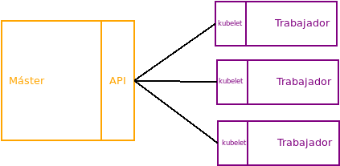
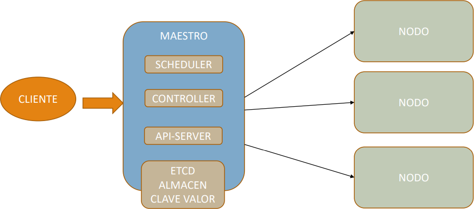

<!-- .slide: class="portada" -->

<!-- --- -->
<!-- .slide: class="titulo" -->

# Kubernetes

* Conceptos Kubernetes
* [Kubernetes en AWS](https://github.com/DevOpsOnline1-Edicion/3.1-Kubernetes/blob/master/AWS.md)
* [Despliegue de Kubernetes](https://github.com/DevOpsOnline1-Edicion/3.1-Kubernetes/blob/master/KOPS.md)
* [Helm](https://helm.sh/)
* [Prometheus y Grafana](https://github.com/DevOpsOnline1-Edicion/3.1-Kubernetes/blob/master/MONITORING.md)
* [Configuración Inverso](https://github.com/DevOpsOnline1-Edicion/3.1-Kubernetes/blob/master/PROXY.md)
* [VPN](https://www.maquinasvirtuales.eu/instalar-openvpn-server-en-kubernetes/)
* [GitOPS](https://github.com/fluxcd/flux)
* [Cluster AutoScaling](https://github.com/DevOpsOnline1-Edicion/3.1-Kubernetes/blob/master/AUTOSCALER.md)
<!-- --- -->

## Recursos

<!-- ---- -->
- [web](https://kubernetes.io/es/)
- [docs](https://kubernetes.io/es/docs/home/)

<!-- --- -->
## Introducción

<!-- ---- -->
### Introducción
Kubernetes (K8s) es una plataforma de código abierto para automatizar la implementación, el escalado y la administración de aplicaciones en contenedores.
También se le denomina k8s, por las 8 letras que hay entre la "k" y la "S", y el proyecto se inición en Julio de 2015 y fue donado posteriormente a Cloud Native Computing Foundation  [CNCF](https://www.cncf.io/)
<!-- .element: style="height:30vh" -->

<!-- ---- -->
### Introducción
Es un proyecto OpenSource creado por Google, el cual lo utiliza en la mayoría de sus proyectos como son Gmail, Maps, Dirve, etc.
Además nos expone de una [api](https://kubernetes.io/docs/concepts/overview/kubernetes-api/) para que de forma programática podamos acceder a la gestión de nuestro cluster.
Como orquestados permite crear un cluster de nodos que implementa determinadas funciones sobre los contenedores:
* Permiten alta disponibilidad.
* Es tolerante a fallos.
* Permite escalar cuando se queda corte de recursos.
* Trabaja de forma eficiente.
* Nos permite realizar cambios y operaicones en caliente.
<!-- ---- -->
### Introducción
Existen otros orquestadores:
* [Docker Swarm](https://docs.docker.com/engine/swarm/)
* [Mesos Marathon](https://mesosphere.github.io/marathon/)
* [Nomad](https://nomadproject.io/)
* [Shipyard](https://shipyard-project.com/)


#### Comparando los principales orquestadores

**Docker Swarm** es el mecanismo de orquestación propio de Docker y está completamente integrado con la API Docker Engine. Esto hace que a cualquier persona que conozca Docker le sea muy sencillo empezar a usar Docker Swarm.

Este orquestador está soportado por AWS, de ahí su valor distribuido, y está basado en una arquitectura de controlador y nodos, donde un nodo es un cluster o instancia de swarm.

Está formado por dos tipos de elementos principales: los managers y los workers.

Los diferentes Managers se organizan entre sí para que uno de ellos sea el líder, asignando tareas a los workers. Un mánager puede también funcionar como worker si el sistema lo requiere.


**Kubernetes** es creado por Google, Kubernetes automatiza la gestión de aplicaciones en contenedores, permitiendo su despliegue, escalado y monitorización, entre otras características.

El despliegue se realiza a través de un datacenter, pero en lugar de gestionar contenedores, gestiona PODs, que pueden estar compuestos por uno o varios contenedores formando un servicio. Los contenedores de un mismo POD corren en el mismo nodo y comparten recursos.

Kubernetes se basa en un modelo de nodos master-slave, donde el master (que puede actuar también como slave) gestiona la creación de PODs y la distribución de los mismos en los diferentes nodos, según la disponibilidad de los recursos en el cluster.


A diferencia de Docker Swarm, Kubernetes utiliza su propia API, con la ventaja de que pueden añadirse nuevas operaciones personalizadas según las necesidades que vayan surgiendo.

Puede trabajar con distintos tipos de contenedores como docker, rkt, cri-o o frakti, y puede trabajar conjuntamente con Apache Mesos.

La instalación de Kubernetes es manual y requiere configuraciones no automáticas, así como conocimiento del cluster que se quiera crear (gestión de roles, IPs…), en consecuencia, es más complejo que Docker Swarm.

Kubernetes permite el escalado de aplicaciones automáticamente mediante Deployments, que son scripts en YAML para la construcción y eliminación de PODs.

Otra ventaja es la alta disponibilidad, proporcionada mediante la supervisión de nodos, detectando los que no están funcionando correctamente y permitiendo eliminarlos.

Al ser de Google, podemos encontrarlo implementado en recursos de su propia plataforma (Google Cloud Platform), como Gmail, Maps, Drive… así como gestionando servidores disponibles en otras plataformas, ya sean públicas (AWS o Rackspace) o privadas (Openshift, Cloud Foundry o Deis).


**Apache Mesos** es un administrador de clusters Opensource basado en el kernel de Linux, aunque puede correr en cualquier plataforma (Linux, Windows o OSX)

Proporciona aplicaciones con APIs para la gestión y planificación de recursos.

Mesos permite el uso del cluster para la ejecución de frameworks sobre los cuales se ejecutan las aplicaciones, distribuyendo la carga entre distintos servidores y evitando sobrecargas.


#### Conclusión
Después de analizar las ventajas e inconvenientes de los tres orquestadores, sólo quedaría elegir cuál es más completo y eficiente. Esto dependerá en cada caso de las necesidades, uso y desempeño de la arquitectura a desarrollar.

En líneas generales, Kubernetes es mucho más completo y complejo; mientras que, por sencillez y arranque inmediato Swarm, sería la mejor opción. Pero si hablamos de tolerancia a fallos aquí Swarm pierde toda la fuerza, de la misma forma que si consideramos los tipos de contenedores soportados.

Mesos, por potencia y servicio, podría presentarse como el contenedor ideal, si no fuera por una comunidad de soporte que, comparada con la de Kubernetes, le hace perder gran valor; a pesar de ello, hablamos de un orquestador perfectamente válido, añadido el hecho de que Kubernetes y Mesos pueden trabajar de forma conjunta.


<!-- --- -->
## Conceptos.

<!-- ---- -->
### Conceptos.
#### Cluster
Un clúster es un conjunto de máquinas, donde cada máquina tiene un rol que se dividen en dos:
* **Máster:** sólo hay uno en el cluster  y es el encargado de repartir la carga de trabajo, entre los demás nodos, mantener el estado deseable de trabajo, escalar las aplicaciones o actualizarlas.
* **Workers:** los demás nodos que nos Máster. Son los que ejecutan las aplicaciones por medio de contenedores:
<!-- .element: style="height:30vh" -->
<!-- ---- -->
### Conceptos.
#### Pod
Es la unidad mínima de Kubernetes. Representa en ejecución en el clúster. Un Pod contiene uno o varios contenedores (por ejemplo Docker), y administrar los recursos de la apliación, dirección IP y distintas opciones que determina como funcionan los contenedores.
#### Labels y selectors
Son pares de claves y valores, las cuales se peude aplicar a pods, services, etc. y con ellos podemos identificarlos para poder gestionarlos.
<!-- ---- -->
### Conceptos.
#### Node.
Es es el servidor ya sea virtual o físico que aloja el sistema de Kubernetes y donde vamos a desplegar los pods, también se les suelen llamar **Minions**
<!-- .element: style="height:30vh" -->
<!-- ---- -->
### Conceptos.
#### Replication Controller.
Es el responsable de gestionar la vida de los pods y el encargado de mantener arrancados los pods que se hayan indicado en la configuración. Permite escalar de forma muy sencilla los sistemas y maneja la recreación de un pod cuando ocurre algun tipo de fallo, en las últimas versiones nos recomienda utilizar **replica Sets.**
#### Replica Sets.
Es la nueva generación de Replication Controller, con nuevas funcionalidades. Una de las funcionalidades destacadas que nos permite desplegar pods en función de los lables y selectors.
<!-- ---- -->
### Conceptos.
#### Deployments
Es una funcionalidad más avanzada que los **Replication Controller**  y nos permite especificar la cantidad de réplicas de pods que tendremos en el sistema.

#### Namespaces.
Son agrupaciones de la infraestructura que nos pemite diferencias espacios de trabajo, por ejemplo desarrollo, producción, etc

<!-- ---- -->
### Conceptos.
#### Volumes
La gestión del sistema de almacenamiento de nuestros pods.
### Secrets
Es donde se guarda la información confidencial como usuario y passwords para acceder a los recursos.
### Service
Es la política de acceso a los pods. Lo podríamos definir como la abstracción que define un conjunto de pods y la lógica para poder acceder a ellos.
<!-- --- -->
## Arquitectura de kubernetes.
<!-- ---- -->
### Arquitectura de kubernetes.
Kubernetes gestiona mediante su nodo maestro para ello dispone de un **Scheduler** que es el planificador de las acciones y trabajo de los distintos nodos workers.

Después disponer del **Controller** nos permmite controlar el estado de los diferentes nodos.

También nos expone un **Api-Server** es decir nos expone un rest donde poder realizar el control de los diferentes nodos.

Y por último dispone del **ETCD ALMACEN CLAVE VALOR** de esta manera obtener elementos mediante su clave y valor.
<!-- .element: style="height:30vh" -->
<!-- ---- -->
### Arquitectura de kubernetes.
En el nodo Worker dispone de un Container Runtime, teniendo en cuenta que no sólo ejecuta docker, sino cualquier otro contenedor, al final dispone de componentes como los pod, que son el elemento básico que utilizamos  en el cluster.
Y después dispone de un agente que se llama **kubelet** que se comunica con el maestro.
Por último se encuentra en **Kube-proxy** que se utiliza para trabajar por los pods, y se utiliza para gestionar y como puntos de entradas a las llamadas de los pods.
<!-- .element: style="height:30vh" -->
<!-- --- -->
## Instalación y configuración de kubernetes
<!-- ---- -->
### Instalación y configuración de kubernetes
Existe diferentes formas y soluciones para instalar kubernetes, desde un entorno en local, hasta en la nuve, etc..
Para ello podemos verlo en su [página](https://kubernetes.io/es/docs/setup/)
Nosotros para aprender utilizare3mos la instalación en nuestro equipo de forma local.
Para ello utilizaremos [MiniKube](https://kubernetes.io/es/docs/tasks/tools/install-minikube/) es una solución que nos va a permitir gestionar nuestro cluster de forma local, para cada uno de las formas de instalar nos dispone de diversas herramientas. e interfaces para la gestión de los clusters.
<!-- ---- -->
### Instalación y configuración de kubernetes en local para prácticas.

1º Instalamos [kubectl](https://kubernetes.io/docs/tasks/tools/install-kubectl/) es una herramienta que nos permite trabajar en modo línea con nustro cluster independientemente del sistema instalado.

2º Después necesitaremos un Hypervisor en caso de linux **VirutalBox o KVM**

3º Comprobar que tenemos el entorno de virtualización activado Vt-x/AMD-v

4º Instalamos [minikube](https://kubernetes.io/es/docs/tasks/tools/install-minikube/)

5ª Alternativamente podemos utilizar [microK8s](https://microk8s.io/) como solución local
<!-- --- -->
## Uso de minikube
<!-- ---- -->
### Uso minikube
Para arrancar nuestros cluster ejecutaremos:
```bash
$ minikube start
```
Para pararlo simplemente:
```bash
$ minikube stop
```
<!-- ---- -->
### Uso minikube
La configuración de nuestro minikube se almacena en el directorio de nuestro usuario en un directorio oculto denominado **.kube**
Ejecutamos:
```bash
$ cat config
```
Además nos provee de un dashboard para ello sólo ejecutamos:
```bash
$ minikube dashboard
```
<!-- --- -->
## Trabajando con Pods.
<!-- ---- -->
### Creando nuestro primer Pod
Kubectl es el cliente que nos va ha permitir controlar nuestro cluster de Kubernetes, para ver toda la informaicón ejecutamos.
```bash
$ kubectl
```
El primer paso es crear un deployment al cual le vamos a asociar la creación de nuestro primer **pod**. 
```bash
$ kubectl run
```
<!-- ---- -->
### Creando nuestro primer Pod
Vamos a desplegar un pod con un contenedor de docker de nginx para ello y viendo las instrucciones del run ejecutaremos:
```bash
$ kubectl run nginx1 --image=nginx
```
Para comprobar el deployment simplemente debemos ejecutar:
```bash
$ kubectl get deployments
```
Realmente con **get** podemos obtener información de cualquier recurso.

¿Que ocurre si intentamos crear un pod a partir de una imagen que no existe?
<!-- ---- -->
### Obteniendo información del Pod.
Para obtener la info de nuestro pods, ejectuaremos:
```bash
$ kubectl get pods
```
Esta información la podemos obtener mediante el dashboard de minikube.
<!-- ---- -->
### Accediendo al Pod.
Para poder acceder a los diferentes recursos necesito mediante **kubectl proxy**, esto ocurre porque el cluster genera una red privada que sólo puede ser accesible desde el interior del cluster o utilizando el componente proxy.
```bash
$ kubectl proxy
```
Vemos que nos expone una ip con un puerto, lo que podemos ver aquí son las diferentes api rest que expone nuestro cluster y por el que podemos configurar y utilizar el mismo.
Por ejemplo para acceder a la info del pod que acabamos de crear en el navegador:
http://localhost:8001/api/v1/namespaces/default/pods/[nombredelpod]
Y para acceder al contenedor mediante el proxy
http://localhost:8001/api/v1/namespaces/default/pods/[nombredelpod]/proxy

<!-- ---- -->
### Accediendo a los contendores y la información del mismo.
Podemos obtener información también de nuestros recursos mediante **describe**
```bash
$ kubectl describe pods
$ kubectl describe pods [nombre del pod]
```
También podemos acceder a los diferentes pods mediante el comando **exec**
```bash
$ kubectl exec -ti [nombredelpod] bash
```
Al igual que docker también podemos acceder a los logs:
```bash
$ kubectl logs [nombre del pod]
```
<!-- ---- -->
### Obteniendo la información del pod en un yaml.
Se puede obtener toda la información del pod en un yaml mediante
```bash
$ kubectl get pod [nombre del pod] -o yaml
```
Esta es la información que ha remitido kubectl a nuestro cluster de kubernetes para crear el ipod.

<!-- ---- -->
### Eliminando los pods.
Vamos a eliminar ahora un pod de los que hemos creado para ello ejecutamos
```bash
kubectl delete -n [namespace] pod [nombre del pod]
```
<!-- ---- -->
### Manifiestos de Kubernetes
Los Manifiestos nos permite crear, modificar o eliminar nuestros recursos y además de adaptar y gestionar los pods, además nos permite establecer un control de versiones en el histórico.
<!-- ---- -->
### Manifiestos de Kubernetes
Vamos ha utilizar el template que nos expone directamente Kubernetes en la siguiente [página](https://kubernetes.io/docs/concepts/workloads/pods/pod-overview/)
Y lo creamos en un archivo denominado pod.yaml
```yaml
apiVersion: v1
kind: Pod
metadata:
  name: podprueba
spec:
  containers:
  - name: contenedor1
    image: nginx    
```
<!-- ---- -->
### Manifiestos de Kubernetes
Ahora simplemente lanzamos la siguiente acción.
```bash
$ kubectl apply -f [nombre del archivo]
```
Y comprobaremos que nos habrá creado este nuevo pod.
Para eliminar este recurso mediante el manifiesto simplemente ejecutamos:
```bash
$ kubectl delete -f [nombre del archivo]
```
En el mismo manifiesto puedo definir varios pods, separados simplemente con ---
<!-- ---- -->
### Manifiestos de Kubernetes
Vamos ahora ha crear dos contenedores en el mismo pod, aunque por regla general es un contenedor por pod.
```yaml
apiVersion: v1
kind: Pod
metadata:
  name: contenedoresduo
spec:
  containers:
  - name: cont1
    image: python:3.6-alpine
    command: ['sh', '-c', 'echo cont1 > index.html && python -m http.server 8085']
  - name: cont2
    image: python:3.6-alpine
    command: ['sh', '-c', 'echo cont2 > index.html && python -m http.server 8086']
```
<!-- ---- -->
### Labels y Pods.
Los Label no se trata más que metadata que lo usamos para diferenciar cada pod, por ejemplo para establecer los diferentes entornos en los que trabajamos.

Creamos un nuevo yaml y vamos a definir 3 pods uno para cada entorno.

Tener un poco de paciencia porque le costará en función de nuestra máquina.

Ahora podemos buscar la información mediante los labels,
```bash
$ kubectl get pods -l app=backend
$ kubectl get pods -l app=front
$ kubectl get pods -l env=dev  
```
<!-- --- -->
## ReplicaSets.
<!-- ---- -->
### ReplicaSets.
Los **ReplicaSets** son componentes superiores que gestionan los pods, para identificar los pods establece **labels** para cada uno  y les añade el owner reference, esta es una marca que apunta cuales son los diferentes pods. Hay que tener en cuenta que los replicaset no puede actualizar el contenido del pods, por ejemplo el cambio de versión de la imagen.
<!-- .element: style="height:30vh" -->

<!-- ---- -->
### ReplicaSets.
Vamos a crear nuestro primer replicaset, para ello podemos utilizar el link de la documentación de [kubernetes](https://kubernetes.io/docs/concepts/workloads/controllers/replicaset/)
Una vez creado podemos lanzarlo con:
```bash
$ kubectl get rs
$ kubectl get replicaset
```
Y a la vez podemos comprobar que nos ha creado los pods.
```bash
$ kubectl get pods
```
<!-- ---- -->
### ReplicaSets.
Si nos acordamos le añadimos una etiqueta a nuestros pods , podemos comprobar que podemos filtrar por la etiqueta.
```bash
$ kubectl get pods -l app=pod-label 
```
Estos pods son idempotentes creados por el replicaset, si yo intento eliminar un pod.
```bash
$ kubectl delete pod [nombre del pod]
```
<!-- ---- -->
### ReplicaSets.
La única manera de gestionar los pods del replicaset deberá ser por el propio replicaset, por ejemplo modifiquemos el número de réplicas.
Vamos a ver como se puede acceder al owner reference del pod para comprobar quien es el replicaset propietario para ello debemos acceder al metadata del pod y buscar la etiqueta *ownerReferences*
```bash
$ kubectl get pod [nombre del pod] -o yaml
```
y nos fijamos en el uid, vamos a buscarlo  en el  metadata del replicaset.
```bash
$ kubectl get rs rs-test -o yaml
```
<!-- ---- -->
### ReplicaSets.
Ahora para eliminar el replicaset que acabamos de crear simplemente debemos ejecutar el siguiente mensaje:
```bash
$ kubectl delete -f rs.yaml
```
<!-- --- -->
## Deployments.
<!-- ---- -->
### Deployments.
Es un componente de mayor jerarquía que el Replicaset, por tanto un deployment puede disponer de varios replicasets. Y nos va ha permitir gestionar los mismos.
<!-- .element: style="height:30vh" -->
<!-- ---- -->
### Deployments.
Vamos a crear nuestro primer deployment mediante un yaml, para ello podemos ir  a la página [web](https://kubernetes.io/docs/concepts/workloads/controllers/deployment/) y coger la referencia.
Para levantarlo simplemente debemos ejecutar.
```bash
$ kubectl apply -f dep.yaml
```
Y podemos ver jerarquicamente la creación del deployment, el replicaset y los pods.
<!-- ---- -->
### Deployments.
Podemos ver los etiquetas  de los deployments mediante 
```bash
  kubectl rollout status deployment deployment-test
```
Los deployments si que me da acceso a la modificación de los componentes hijos, por tanto podría modificar un pod y mediante.
```bash
$ kubectl apply -f dep.yaml
```
Podriamos comprobar los cambios producidos en tiempo real ejecutando.
```bash
$ kubectl rollout status deployment deployment-test
```
<!-- ---- -->
### Deployments.
Con el histórico podemos realizar un **rollback** del deployment y volver a una versión anterior ya que kubernetes nos permite mantener un histórico
```bash
$ kubectl rollout history deployment [nombre del deployment]
```
Hacemos una modificación de nuestra versión de nginx y ejecutamos el
```bash
$ kubectl apply -f ds.yaml
```
<!-- ---- -->
### Deployments.
Y hacemos un rollout sobre una versión anterior
```bash
$ kubectl rollout undo deployment deployment-test --to-revision=1
```
Y comprobamos el histórico en los eventos del deployment.
```
$ kubectl describe deployments.apps deployment-tet
```

<!-- --- -->
## Creando nuestro primer servicio
<!-- ---- -->
### Creando nuestro primer servicio.
Podemos ver los servicios que tenemos creado mediante.
```bash
$ kubectl get service
```
Existen diferentes formas de crear servicios, mediante **create** y  un archivo yaml donde definimos el mismo.
O mediante la instrucción **expose**
```bash
$ kubectl expose deployments/nginx1 --type=NodePort --port 80
```
<!-- ---- -->
### Creando nuestro primer servicio.
Podemos comprobar si se ha creado mediante
```bash
$ kubectl get services
```
Simplemente ahora para poder acceder al servicio expuesto debemo acceder a la ip del servicio de minikube y el puerto que nos expone bindeado respecto al contenedor
http://192.168.99.100:31918/
<!-- --- -->
## Escalando nuestro primer servicio
<!-- ---- -->
### Escalando nuestro primer servicio
Vamos a ver como apliar o escalar un **servicio**, para ello simplemente ejecutamos:
```bash
$ kubectl scale deployments/nginx1 --replicas=3
```
Podemos comprobar si realmente ha escalado mediante
```bash
$ kubectl get pods -o wide
```
<!-- --- -->
## Eliminando nuestros componentes
<!-- ---- -->
### Eliminando nuestros componentes


Para eliminar un servicio
```bash
kubectl delete -n [namespace] service [nombre del pod]
```


